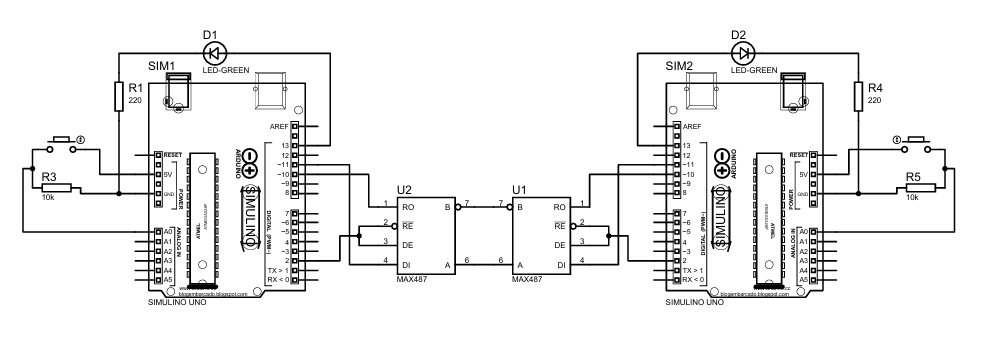

  

<h1 align="center">Arduino RS-485 Communication System</h1>

Arduino-based RS-485 serial communication with node-based control.

---

## 📌 Project Overview
This project is an **Arduino-based RS-485 communication system** designed to demonstrate
industrial-style serial communication between multiple devices.

Each Arduino operates as an independent node on a shared RS-485 bus and communicates
using a simple command-based protocol. The project focuses on understanding
**half-duplex communication**, **direction control**, and **node identification**,
which are commonly used concepts in industrial automation systems.

This project demonstrates:
- RS-485 half-duplex communication
- Node-based device addressing
- Direction control using DE/RE pins
- Basic command-based messaging
- Embedded systems communication fundamentals

---

## 🧠 System Description
The RS-485 communication system performs the following tasks:
- Enables serial communication between multiple Arduino nodes
- Controls transmission and reception using DE/RE pins
- Uses unique node IDs to identify devices on the bus
- Processes incoming commands and triggers output actions
- Demonstrates reliable communication over a shared serial line

---

## 🧩 Project Versions

### 🔹 v1 – Initial Version (May 2024)
- Basic RS-485 communication established
- Node ID–based message handling implemented
- Half-duplex direction control logic added
- Button-triggered command transmission
- LED-based output control

---

## 🛠️ Technologies Used
- Arduino Uno
- MAX485 / MAX487 RS-485 Transceiver
- C / C++ (Arduino Framework)
- Arduino IDE
- SoftwareSerial Library

---

## ⚙️ Communication Details
- **Communication Type:** UART over RS-485
- **Baud Rate:** 9600
- **Data Format:** 8N1
- **Topology:** Half-Duplex, Multi-Drop
- **Addressing:** Node ID–based

---

## 📦 Repository Usage
1. Clone or download the repository.
2. Open the project using **Arduino IDE**.
3. Upload the code to the Arduino boards.
4. Connect the RS-485 transceivers (A/B lines).
5. Power the system and observe communication between nodes.

---

## 🎓 Notes
- This project was developed for **learning and portfolio purposes**.
- Created through research and practical experimentation.
- Not intended for production or safety-critical applications.

---

## 👤 Author
**Arda Bektaş**  
Industrial Automation & Embedded Systems Enthusiast
